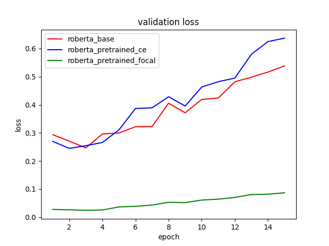
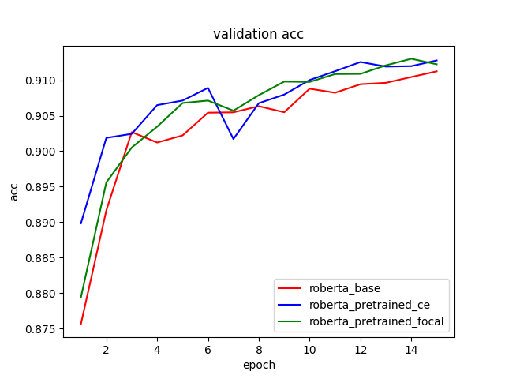
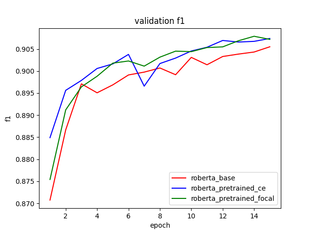

# Quora-Question-Pairs Project
This is the final project of nis8021. Sentence similarity prediction on Quora Question Pairs Dataset. The dataset is splitted into train/valid/test set in [./data](data)

# Result
| Model | Test Accuracy | Test F1 Score |
|---|---|---|
| RoBERTa_base + CE loss | 0.910633 | 0.904185 |
| RoBERTa_pretrained + CE loss| 0.913156| 0.907138 |
| RoBERTa_pretrained + Focal loss | 0.913453|  0.907755 |
| Stacking | **0.917955** | **0.912335** |

# Focal loss 
Focal loss uses two parameters $\alpha$ and $\gamma$. $\alpha$ is determined by 0/1 sample distribution. $\gamma$ is estimated by easy/hard sample distribution.

```bash
python cal_focal_params.py
```

# Run
1. Pretrain on QQP
```bash
bash run_pretrain.sh
```

2. Finetune with RoBERTa_base
```bash
bash run_finetune_roberta-base.sh
```

3. Finetune with RoBERTa_pre
```bash
bash run_finetune_ce.sh
```

4. Finetune with RoBERTa_pre using focal loss
```bash
bash run_finetune_focal.sh
```

5. Inference to construct dataset for stacking
```bash
bash inference.sh
```

6. Train a Stacking model
```bash
python stacking.py
```

# Finetune Curve



